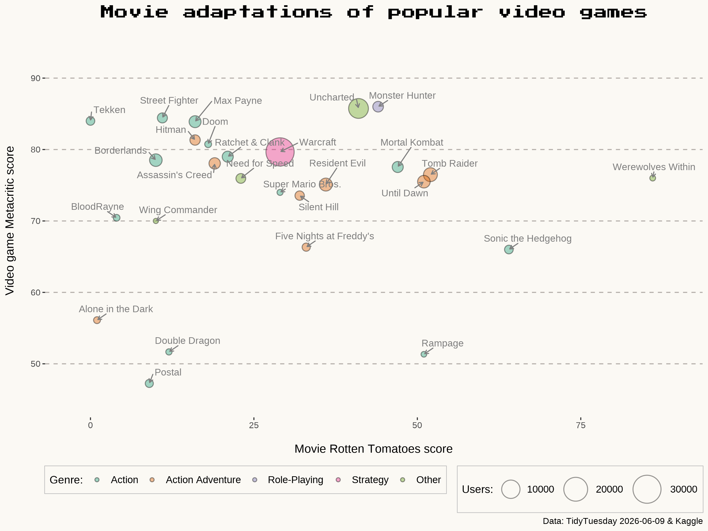

# TidyTuesday

My contributions to the [TidyTuesday](https://github.com/rfordatascience/tidytuesday) weekly data project; a community initiative that releases a new dataset every Tuesday for exploration and visualization in R.

## About

Each folder in this repo corresponds to a different TidyTuesday week and contains:
- An R Markdown file (`.Rmd`) with the full analysis
- Inidividual R scripts wherever applicable
- The resulting plot(s)
- Any locally saved data files used

## Analyses

| Week | Topic | Preview |
|------|-------|---------|
| 2026-06-09 | 🎮 Video Game Film Adaptations |  |
